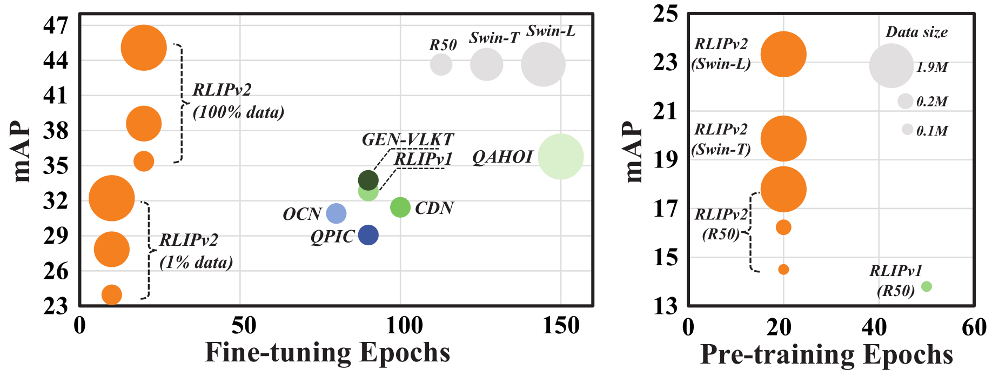

<div align="center">
<h1> RLIPv2: Fast Scaling of Relational Language-Image Pre-training
</h1>

<div>
    <a href='https://jacobyuan7.github.io/' target='_blank'>Hangjie Yuan</a>&emsp;
    <a href='https://scholar.google.com/citations?user=ZO3OQ-8AAAAJ&hl=en&oi=ao' target='_blank'>Shiwei Zhang</a>&emsp;
    <a href='https://scholar.google.com/citations?user=cQbXvkcAAAAJ&hl=en' target='_blank'>Xiang Wang</a>&emsp;
    <a href='https://samuelalbanie.com/' target='_blank'>Samuel Albanie</a>&emsp;
    <a href='https://pynsigrid.github.io/' target='_blank'>Yining Pan</a>&emsp;<br>
<!--     Yining Pan&emsp;<br> -->
    <a href='https://scholar.google.com/citations?user=JT8hRbgAAAAJ&hl=en' target='_blank'>Tao Feng</a>&emsp;
    <a href='https://scholar.google.com/citations?user=37gvStUAAAAJ&hl=en' target='_blank'>Jianwen Jiang</a>&emsp;
    <a href='https://scholar.google.com/citations?user=boUZ-jwAAAAJ&hl=en' target='_blank'>Dong Ni&#9993</a>&emsp;
    <a href='https://scholar.google.com/citations?user=16RDSEUAAAAJ&hl=en' target='_blank'>Yingya Zhang</a>&emsp;
    <a href='https://scholar.google.com/citations?user=7LhjCn0AAAAJ&hl=en' target='_blank'>Deli Zhao</a>&emsp;
</div>
    
<strong>Accepted to <a href='https://iccv2023.thecvf.com/' target='_blank'>ICCV 2023</a> :partying_face:</strong>

[](https://arxiv.org/abs/2308.09351)
[](https://github.com/JacobYuan7/RLIPv2)
[](https://github.com/JacobYuan7/RLIPv2)
[](https://hits.seeyoufarm.com)
</div>



> Abstract:
> Relational Language-Image Pre-training (RLIP) aims to align vision representations with relational texts, thereby advancing the capability of relational reasoning in computer vision tasks.
> However, hindered by the slow convergence of RLIPv1 architecture and the limited availability of existing scene graph data, scaling RLIPv1 is challenging.
> In this paper, we propose RLIPv2, a fast converging model that enables the scaling of relational pre-training to large-scale pseudo-labelled scene graph data.
> To enable fast scaling, RLIPv2 introduces Asymmetric Language-Image Fusion (ALIF), a mechanism that facilitates earlier and deeper gated cross-modal fusion with sparsified language encoding layers.
> ALIF leads to comparable or better performance than RLIPv1 in a fraction of the time for pre-training and fine-tuning.
> To obtain scene graph data at scale, we extend object detection datasets with free-form relation labels by introducing a captioner (\textit{e.g.,} BLIP) and a designed Relation Tagger.
> The Relation Tagger assigns BLIP-generated relation texts to region pairs, thus enabling larger-scale relational pre-training.
> Through extensive experiments conducted on Human-Object Interaction Detection and Scene Graph Generation, RLIPv2 shows state-of-the-art performance on three benchmarks under fully-finetuning, few-shot and zero-shot settings.
> Notably, the largest RLIPv2 achieves 23.29mAP on HICO-DET without any fine-tuning, yields 32.22mAP with just 1\% data and yields 45.09mAP with 100\% data.


## Todo list
Note that if you can not get access to the links provided below, try using another browser or contact me by e-mail. 
- [x] 🎉 Release code for pre-training, fine-tuning and inference.
- [x] 🎉 Release pre-training and fine-tuning annotations. 
- [x] 🎉 Release checkpoints for pre-training, few-shot, zero-shot and fine-tuning.  

<!-- - [ ] 🕘 Include support for inference on custom images. -->


## Information before using this repo
I changed all the paths to prevent from possible information leakage.
In order to run the code, you will need to configure the paths to match your own system.
To do this, search for the "/PATH/TO" placeholder in the code and replace it with the appropriate file path on your system. 
⭐⭐⭐Consider starring the repo! ⭐⭐⭐

## Environment setup
I recommend creating a new conda environment in order to run the code.
You can check `scripts/create_environment.txt` to acquire details on how to set up the environment.

## Model outline
This repo contains the implementation of various methods to resolve HOI detection (not limited to RLIP), aiming to serve as a benchmark for HOI detection. Below methods are included in this repo:
 - [RLIPv2-ParSeDA](https://arxiv.org/abs/2308.09351) (model name in the repo: RLIP_ParSeDA_v2);
 - [RLIPv2-ParSeD](https://arxiv.org/abs/2308.09351) (model name in the repo: RLIP_ParSeD_v2);
 - [RLIP-ParSe](https://arxiv.org/abs/2209.01814) (model name in the repo: RLIP-ParSe);
 - [ParSe](https://arxiv.org/abs/2209.01814) (model name in the repo: ParSe);
 - [RLIP-ParSeD](https://arxiv.org/abs/2209.01814) (model name in the repo: RLIP-ParSeD);
 - [ParSeD](https://arxiv.org/abs/2209.01814) (model name in the repo: ParSeD);
 - [OCN](https://github.com/JacobYuan7/OCN-HOI-Benchmark) (model name in the repo: OCN), which is a prior work of RLIP;  
 - [QPIC](https://github.com/hitachi-rd-cv/qpic) (model name in the repo: DETRHOI);
 - [QAHOI](https://github.com/cjw2021/QAHOI) (model name in the repo: DDETRHOI);
 - [CDN](https://github.com/YueLiao/CDN) (model name in the repo: CDN);


## Citation
```bibtex
@inproceedings{Yuan2023RLIPv2,
  title={RLIPv2: Fast Scaling of Relational Language-Image Pre-training},
  author={Yuan, Hangjie and Zhang, Shiwei and Wang, Xiang and Albanie, Samuel and Pan, Yining and Feng, Tao and Jiang, Jianwen and Ni, Dong and Zhang, Yingya and Zhao, Deli},
  booktitle={Proceedings of the IEEE/CVF International Conference on Computer Vision},
  year={2023}
}

@inproceedings{Yuan2022RLIP,
  title={RLIP: Relational Language-Image Pre-training for Human-Object Interaction Detection},
  author={Yuan, Hangjie and Jiang, Jianwen and Albanie, Samuel and Feng, Tao and Huang, Ziyuan and Ni, Dong and Tang, Mingqian},
  booktitle={Advances in Neural Information Processing Systems (NeurIPS)},
  year={2022}
}

@inproceedings{Yuan2022OCN,
  title={Detecting Human-Object Interactions with Object-Guided Cross-Modal Calibrated Semantics},
  author={Hangjie Yuan and Mang Wang and Dong Ni and Liangpeng Xu},
  booktitle={AAAI},
  year={2022}
}
```


## Annotation preparation
| Dataset | Setting | Download |
| ---------- | :-----------:  | :-----------:  |
| VG | RLIP | [Link](https://1drv.ms/u/c/e2b8cd450f9e9eb7/Qbeeng9FzbgggOJOJAAAAAAAGbDzTYaCFQ2Z5Q) |
| COCO (pseudo) | RLIP | [Link](https://1drv.ms/u/c/e2b8cd450f9e9eb7/Ebeeng9FzbgggOIMJAAAAAABSSme69DgBgxkoZj-u1xqkg) |
| Objects365 (pseudo) | RLIP | [Link](https://1drv.ms/u/c/e2b8cd450f9e9eb7/Ebeeng9FzbgggOIMJAAAAAABSSme69DgBgxkoZj-u1xqkg) |
| Open Images | Fully-finetuning  | [Link](https://1drv.ms/u/c/e2b8cd450f9e9eb7/Ebeeng9FzbgggOIMJAAAAAABSSme69DgBgxkoZj-u1xqkg) |
| HICO-DET | Few-shot 1%, 10% | [Link](https://1drv.ms/f/c/e2b8cd450f9e9eb7/Qreeng9FzbgggOJAIgAAAAAAUXVUO7BPLCMolg) |
| HICO-DET | Zero-shot (UC-NF, UC-RF)\* | [Link](https://1drv.ms/f/c/e2b8cd450f9e9eb7/Qreeng9FzbgggOJCIgAAAAAAv6ldXAMKyzFtwA) |


Note: ① \* Zero-shot (NF) do not need any HICO-DET annotations for fine-tuning, so we only provide training annotations for the UC-NF and UC-RF setting.


## Pre-training datasets preparation

### 1. Visual Genome
Firstly, we could download VG dataset from the [official link](https://visualgenome.org/api/v0/api_home.html), inclduing images Part I and Part II. (**Note: If the official website is not working, you can use the link that I provide: [Images](https://1drv.ms/u/s!Areeng9FzbjiyHQu_6NbSmsQf81D?e=BgMdXE) and [Images2](https://1drv.ms/u/s!Areeng9FzbjiyGUtQ8gfA7VVMvVp?e=aRzQeR).**) The annotations after pre-processing could be downloaded from the link above, which is used for pre-training. Note that this is generated from `scene_graphs.json` file by several pre-processing steps to remove redundant triplets. Also, several settings mentioned below also need the annotations that we provide. VG dataset and its corresponding annotations should be organized as follows:
```
VG
 |─ annotations
 |   |— scene_graphs_after_preprocessing.json
 |   :
 |— images
 |   |— 2409818.jpg
 |   |— n102412.jpg
 :   :
```

### 2. COCO
Firstly, try downloading the [COCO2017](https://cocodataset.org/#download) dataset from the official link. If you want to run R-Tagger, you need to download the bounding box annotations from the website as well. If you just want to perform relational pre-training, you can merely download the pseudo-annotations for COCO2017.
The dataset should be organized as follows:
```
COCO2017
 |— annotations
 |   |— instances_train2017.json
 |   |— instances_val2017.json
 |   └─ RLIPv2_train2017_threshold20.....json
 |   
 |— train2017
 |   |— 000000498666.jpg
 |   :
 |
 |— val2017
 |   |— 000000414261.jpg
 :   :
```

### 3. Objects365
Firstly, download the [Objects365](https://www.objects365.org/download.html) dataset from the official link. This dataset contains 51 training patches and 44 validation patches, which are summed to more than 1700k images used for pre-training. 
Similarly, if you want to run R-Tagger, you need to download the bounding box annotations from the website as well. 
If you just want to perform relational pre-training, you can merely download the pseudo-annotations for Objects365.
(Btw, you can try use the script in `scripts/datasets` folder.)
The dataset should be organized as follows:
```
Objects365
 |— train 
 |   |— patch0
 |   |— patch1
 |   :
 |   |— patch50
 |   └─ zhiyuan_objv2_train.json
 |
 |— val
 |   |— patch0
 |   |— patch1
 |   :
 |   |— patch43
 |   └─ zhiyuan_objv2_val.json
 |
 |— rel_annotations
 |    └─ RLIPv2_o365trainval_Tagger2.....json
 |
 └─ image_id_to_filepath.json
```


## Downstream dataset preparation
### 1. HICO-DET
HICO-DET dataset can be downloaded [here](https://drive.google.com/open?id=1QZcJmGVlF9f4h-XLWe9Gkmnmj2z1gSnk). After finishing downloading, unpack the tarball (`hico_20160224_det.tar.gz`) to the `data` directory.

Instead of using the original annotations files, we use the annotation files provided by the PPDM authors. The annotation files can be downloaded from [here](https://drive.google.com/open?id=1WI-gsNLS-t0Kh8TVki1wXqc3y2Ow1f2R). The downloaded annotation files have to be placed as follows.
```
qpic
 |─ data
 │   └─ hico_20160224_det
 |       |─ annotations
 |       |   |─ trainval_hico.json
 |       |   |─ test_hico.json
 |       |   └─ corre_hico.npy
 :       :
```

### 2. V-COCO
First clone the repository of V-COCO from [here](https://github.com/s-gupta/v-coco), and then follow the instruction to generate the file `instances_vcoco_all_2014.json`. Next, download the prior file `prior.pickle` from [here](https://drive.google.com/drive/folders/10uuzvMUCVVv95-xAZg5KS94QXm7QXZW4). Place the files and make directories as follows.
```
qpic
 |─ data
 │   └─ v-coco
 |       |─ data
 |       |   |─ instances_vcoco_all_2014.json
 |       |   :
 |       |─ prior.pickle
 |       |─ images
 |       |   |─ train2014
 |       |   |   |─ COCO_train2014_000000000009.jpg
 |       |   |   :
 |       |   └─ val2014
 |       |       |─ COCO_val2014_000000000042.jpg
 |       |       :
 |       |─ annotations
 :       :
```
The annotation file has to be converted to the HOIA format. The conversion can be conducted as follows.
```
PYTHONPATH=data/v-coco \
        python convert_vcoco_annotations.py \
        --load_path data/v-coco/data \
        --prior_path data/v-coco/prior.pickle \
        --save_path data/v-coco/annotations
```
Note that only Python2 can be used for this conversion because `vsrl_utils.py` in the v-coco repository shows a error with Python3.

V-COCO annotations with the HOIA format, `corre_vcoco.npy`, `test_vcoco.json`, and `trainval_vcoco.json` will be generated to `annotations` directory.

### 3. Open Images v6
Open Images v6 can be downloaded from this [link](https://github.com/SHTUPLUS/PySGG/blob/main/DATASET.md).
We transform the annotations to the HICO-DET format, which can be downloaded from the link provided [above](## Annotation Preparation).
The dataset should be organized as follows:
```
Open Images v6
 |
 |─ images
 |    |─ ca5267a6336b71ea.jpg
 |    :
 |
 └─ annotations
```

## Relational Language-Image Pre-training
We provide a series of pre-trained weights for you to use.
First of all, we provide weights after relational pre-training (RLIP weights) on VG+COCO+Objects365 using RLIPv2-ParSeDA.
| Model | Pre-training Paradigm | Pre-training Dataset | Backbone | Download |
| ---------- | :-----------: | :-----------: | :-----------: | :-----------: |
| RLIPv2-ParSeDA | RLIP | VG+COCO+O365 | ResNet-50 | [Link](https://1drv.ms/f/s!Areeng9FzbjixA-4QhhMWzWQw-Mb?e=1uAxp7) |
| RLIPv2-ParSeDA | RLIP | VG+COCO+O365 | Swin-T | [Link](https://1drv.ms/f/s!Areeng9FzbjixA-4QhhMWzWQw-Mb?e=1uAxp7) |
| RLIPv2-ParSeDA | RLIP | VG+COCO+O365 | Swin-L | [Link](https://1drv.ms/f/s!Areeng9FzbjixA-4QhhMWzWQw-Mb?e=1uAxp7) |

Secondly, we provide object detection weights (OD weights) on COCO+Objects365, used to initialize RLIPv2-ParSeDA for RLIP.
| Model | Pre-training Paradigm | Pre-training Dataset | Backbone | Download |
| ---------- | :-----------: | :-----------: | :-----------: | :-----------: |
| RLIPv2-ParSeDA | OD | COCO | ResNet-50 | [Link](https://1drv.ms/f/s!Areeng9FzbjixA1zcKioiaYVhvV4?e=imxrXW) |
| RLIPv2-ParSeDA | OD | COCO+O365 | ResNet-50 | [Link](https://1drv.ms/f/s!Areeng9FzbjixA1zcKioiaYVhvV4?e=imxrXW) |
| RLIPv2-ParSeDA | OD | COCO | Swin-T | [Link](https://1drv.ms/f/s!Areeng9FzbjixA1zcKioiaYVhvV4?e=imxrXW) |
| RLIPv2-ParSeDA | OD | COCO+O365 | Swin-T | [Link](https://1drv.ms/f/s!Areeng9FzbjixA1zcKioiaYVhvV4?e=imxrXW) |
| RLIPv2-ParSeDA | OD | COCO | Swin-L | [Link](https://1drv.ms/f/s!Areeng9FzbjixA1zcKioiaYVhvV4?e=imxrXW) |
| RLIPv2-ParSeDA | OD | COCO+O365 | Swin-L | [Link](https://1drv.ms/f/s!Areeng9FzbjixA1zcKioiaYVhvV4?e=imxrXW) |

Note that all the scripts used for pre-training RLIPv2 are presented under `scripts/RLIP_ParSeDA`.
For instance, `train_RLIP_ParSeDA_v2_mixed_vgcocoo365_swinL.sh` means that this script is responsible for pre-training on mixed datasets of VG+COCO+O365 using Swin-L and RLIPv2-ParSeDA.

## Downstream tasks
We provide a series of checkpoints below, which could be used for reproducing results in the paper.
Note that all the scripts used for fine-tuning RLIPv2 are presented under `scripts/RLIP_ParSeDA`.
For instance, `fine_tune_RLIP_ParSeDA_v2_hico_swinL_few-shot.sh` means that this script is responsible for few-shot transfer on HICO-DET using Swin-L and RLIPv2-ParSeDA.

### Fully fine-tuning on HICO-DET
| Model | Backbone | Rare / Non-Rare / Full | Download |
| ----- | :------: | :--------------------: | :------: |
| RLIPv2-ParSeDA | ResNet-50 | 29.61 / 37.10 / 35.38 | [Link](https://1drv.ms/f/s!Areeng9Fzbjiw1AZ_s4PJDBEmceO?e=cBeJRl) |
| RLIPv2-ParSeDA | Swin-T | 33.66 / 40.07 / 38.60 | [Link](https://1drv.ms/f/s!Areeng9Fzbjiw1AZ_s4PJDBEmceO?e=cBeJRl) |
| RLIPv2-ParSeDA | Swin-L | 43.23 / 45.64 / 45.09 | [Link](https://1drv.ms/f/s!Areeng9Fzbjiw1AZ_s4PJDBEmceO?e=cBeJRl) |

### Few-shot transfer on HICO-DET
| Model | Backbone | Setting | Rare / Non-Rare / Full | Download |
| ----- | :------: | :-----: | :--------------------: | :------: |
| RLIPv2-ParSeDA | ResNet-50 | 1% | 22.13 / 24.51 / 23.96 | [Link](https://1drv.ms/f/s!Areeng9Fzbjiw08xUlwoRTmXCfu8?e=wilesB) |
| RLIPv2-ParSeDA | ResNet-50 | 10% | 23.28 / 30.02 / 28.46 | [Link](https://1drv.ms/f/s!Areeng9Fzbjiw08xUlwoRTmXCfu8?e=wilesB) |
| RLIPv2-ParSeDA | Swin-T | 1% | 24.26 / 28.92 / 27.85 | [Link](https://1drv.ms/f/s!Areeng9Fzbjiw08xUlwoRTmXCfu8?e=wilesB) |
| RLIPv2-ParSeDA | Swin-T | 10% | 28.31 / 32.93 / 31.87 | [Link](https://1drv.ms/f/s!Areeng9Fzbjiw08xUlwoRTmXCfu8?e=wilesB) |
| RLIPv2-ParSeDA | Swin-L | 1% | 31.89 / 32.32 / 32.22 | [Link](https://1drv.ms/f/s!Areeng9Fzbjiw08xUlwoRTmXCfu8?e=wilesB) |
| RLIPv2-ParSeDA | Swin-L | 10% | 34.75 / 38.27 / 37.46 | [Link](https://1drv.ms/f/s!Areeng9Fzbjiw08xUlwoRTmXCfu8?e=wilesB) |

### Zero-shot on HICO-DET
| Model | Backbone | Setting | Rare / Non-Rare / Full | Download |
| ----- | :------: | :-----: | :--------------------: | :------: |
| RLIPv2-ParSeDA | ResNet-50 | NF | 19.64 / 17.24 / 17.79 | [Link](https://1drv.ms/f/s!Areeng9FzbjixA-4QhhMWzWQw-Mb?e=1uAxp7) |
| RLIPv2-ParSeDA | ResNet-50 | UC-RF | 21.45 / 35.85 / 32.97 | [Link](https://1drv.ms/f/s!Areeng9Fzbjiw1Zs3bHxykLj-GlV?e=W03Jai) |
| RLIPv2-ParSeDA | ResNet-50 | UC-NF | 22.81 / 29.52 / 28.18 | [Link](https://1drv.ms/f/s!Areeng9Fzbjiw1Zs3bHxykLj-GlV?e=W03Jai) |
| RLIPv2-ParSeDA | Swin-T | NF | 21.24 / 19.47 / 19.87 | [Link](https://1drv.ms/f/s!Areeng9FzbjixA-4QhhMWzWQw-Mb?e=1uAxp7) |
| RLIPv2-ParSeDA | Swin-T | UC-RF | 26.95 / 39.92 / 37.32 | [Link](https://1drv.ms/f/s!Areeng9Fzbjiw1Zs3bHxykLj-GlV?e=W03Jai) |
| RLIPv2-ParSeDA | Swin-T | UC-NF | 21.07 / 35.07 / 32.27 | [Link](https://1drv.ms/f/s!Areeng9Fzbjiw1Zs3bHxykLj-GlV?e=W03Jai) |
| RLIPv2-ParSeDA | Swin-L | NF | 27.97 / 21.90 / 23.29 | [Link](https://1drv.ms/f/s!Areeng9FzbjixA-4QhhMWzWQw-Mb?e=1uAxp7) |
| RLIPv2-ParSeDA | Swin-L | UC-RF | 31.23 / 45.01 / 42.26 | [Link](https://1drv.ms/f/s!Areeng9Fzbjiw1Zs3bHxykLj-GlV?e=W03Jai) |
| RLIPv2-ParSeDA | Swin-L | UC-NF | 22.65 / 40.51 / 36.94 | [Link](https://1drv.ms/f/s!Areeng9Fzbjiw1Zs3bHxykLj-GlV?e=W03Jai) |

### Fully fine-tuning on V-COCO
| Model | Backbone | AP_1 / AP_2 | Download |
| ----- | :------: | :--------------------: | :------: |
| RLIPv2-ParSeDA | ResNet-50 | 65.9 / 68.0 | [Link](https://1drv.ms/f/c/e2b8cd450f9e9eb7/Qreeng9FzbgggOLSIQAAAAAAyL_yAmT7JHcWgw) |
| RLIPv2-ParSeDA | Swin-T | 68.8 / 70.8 | [Link](https://1drv.ms/f/c/e2b8cd450f9e9eb7/Qreeng9FzbgggOLSIQAAAAAAyL_yAmT7JHcWgw) |
| RLIPv2-ParSeDA | Swin-L | 72.1 / 74.1 | [Link](https://1drv.ms/f/c/e2b8cd450f9e9eb7/Qreeng9FzbgggOLSIQAAAAAAyL_yAmT7JHcWgw) |


### Fully fine-tuning on Open Images v6
| Model | Backbone | R@50 / wmAP_rel / wmAP_phr / score_wtd | Download |
| ----- | :------: | :------------------------------------: | :------: |
| RLIPv2-ParSeDA | ResNet-50 | 65.99 / 49.54 / 45.71 / 51.30 | [Link](https://1drv.ms/f/s!Areeng9Fzbjiw1FgKUAHqiueeeFH?e=Qb7cWb) |
| RLIPv2-ParSeDA | Swin-T | 68.81 / 52.70 / 48.01 / 54.05 | [Link](https://1drv.ms/f/s!Areeng9Fzbjiw1FgKUAHqiueeeFH?e=Qb7cWb) |
| RLIPv2-ParSeDA | Swin-L | 72.49 / 56.38 / 50.70 / 57.34 | [Link](https://1drv.ms/f/s!Areeng9Fzbjiw1FgKUAHqiueeeFH?e=Qb7cWb) |


## Evaluation
The mAP on HICO-DET under the Full set, Rare set and Non-Rare Set will be reported during the training process.

The results for the official evaluation of V-COCO must be obtained by the generated pickle file of detection results. You can refer to [test_vcoco_official.sh](https://github.com/JacobYuan7/RLIPv2/blob/main/scripts/RLIP_ParSeDA/test_vcoco_official.sh) for more details on running 
`generate_vcoco_official.py`.
<!-- ```shell
cd /PATH/TO/RLIP
python generate_vcoco_official.py \
        --param_path /PATH/TO/CHECKPOINT \
        --save_path vcoco.pickle \
        --hoi_path /PATH/TO/VCOCO/DATA \
``` -->
Then you should run following codes after modifying the path to get the final performance:
```shell
cd /PATH/TO/RLIP
python datasets/vsrl_eval.py
```

## Relational pseudo-labelling
As detailed in the Figure 3 of the main paper, it involves (i) generating the captions using a captioner (i.e. BLIP), (ii) generating a relation candidate set and (iii) assigning relation texts to region pairs via an R-Tagger.
- Step 1: run `RLIP_caption_coco.py` under the `BLIP-main` folder to generate captions. Code are available [here](https://github.com/JacobYuan7/BLIP_for_RLIPv2).
- Step 2: run `transform_BLIP_sentences_to_triplets()` function in `datasets/rlipv2_helper/BLIP_coco_caption_helper.py` to obtain scene graphs and run `transform_BLIP_sngs_to_verb_tagger_input_format()` function in `datasets/rlipv2_helper/BLIP_coco_caption_helper.py` to obtain relation candidate sets for images.
- Step 3: run `scripts/verb_tagger/test_Tagger_resnet.sh` script (which runs `generate_relations_using_verb_tagger.py`) to assign relation texts to region pairs via R-Tagger. The parameters and generated captions can be downloaded from [this link](https://1drv.ms/f/c/e2b8cd450f9e9eb7/Qreeng9FzbgggOLVIQAAAAAAAWJzWYjRH6OSpw).


## Acknowledgement
Part of this work's implemention refers to several prior works including [RLIP](https://github.com/JacobYuan7/RLIP), [OCN](https://github.com/JacobYuan7/OCN-HOI-Benchmark), [QPIC](https://github.com/hitachi-rd-cv/qpic), [CDN](https://github.com/YueLiao/CDN), [DETR](https://github.com/facebookresearch/detr), [DDETR](https://github.com/fundamentalvision/Deformable-DETR), [MDETR](https://github.com/ashkamath/mdetr) and [GLIP](https://github.com/microsoft/GLIP).
